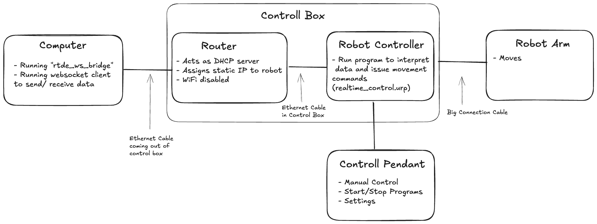

# Universal Robot Documentation & Code

This repository contains documentation and code to work with the Universal Robot UR5e at the Roskilde University.
The repository is still being developed, currently only a few hints and and a code sample for real time control are provided


# Documentation

## Links
[Real time docs](https://docs.universal-robots.com/tutorials/communication-protocol-tutorials/rtde-guide.html) 

[End effector I/Os](https://www.universal-robots.com/manuals/EN/HTML/SW5_21/Content/prod-usr-man/complianceUR30/SW_sections/first_program/io_tool.htm)

[Datasheet](https://www.universal-robots.com/media/1807465/ur5e_e-series_datasheets_web.pdf)

[Simulator](https://docs.universal-robots.com/Universal_Robots_ROS_Documentation/doc/ur_client_library/doc/setup/ursim_docker.html)

## Remote Control

### Test
1. Connect computer via ethernet cable
2. Make sure that the network settings are set to DHCP on your computer
3. Try to connect to the robot:
4. type the following in a terminal / command line: ```ping 10.0.0.4```

> [!NOTE]
> On macOS make sure to allow the terminal or your program to access the local network:
> ```System Settings -> Privacy & Security -> Local Network: <Enable for your program> ```

### Troubleshooting

### Check IP

   1. On the robot interface click on the hamburger menu in the top right corner
   2. Click ```Info```
   3. See ```IP Address```
   4. If the IP is set and it shows ```connected```try to use that IP to ping the robot. 

### Disable other networks
The IP range of the router connected to the robot should not yield public IP addresses but to double check disable WIFI and other network connections.

### Dashboard Server (not actually a GUI)
Once a simple ping to the robot is working you can access the RemoteDashboard API by running the following command:
```nc 10.0.0.4 29999```

Afterwards commands can be send from the running session.

Available commands can be found [here](https://s3-eu-west-1.amazonaws.com/ur-support-site/42728/DashboardServer_e-Series_2022.pdf).

### Real Time Data Exchange (RTDE)

[Docs](https://docs.universal-robots.com/tutorials/communication-protocol-tutorials/rtde-guide.html)


### Remote uploading of files

1. Download Filezilla
2. In Filezilla connect with:
```
IP: 10.0.0.4 or IP of robot
User: root
Password: <password is in the robot controller box>
Port: 22
```
3. Move program files into the ```/programs/``` directory.
4. On the robot, load the program by going to ```Program->Open...-> Program```

> [!CAUTION]
> Only upload, change or delete files in the ```/programs``` directory!
> Removing other files might break the robot.

[Docs](https://docs.universal-robots.com/tutorials/urscript-tutorials/ftp.html)

## Running the Simulator

1. Install docker (or orbstack)
2. Run this command from the root of the project:
```docker run --rm -it -v "./programs:/ursim/programs" -p 5900:5900 -p 6080:6080 --name ursim universalrobots/ursim_e-series -e ROBOT_MODEL=UR5e```
3. Go to web interface, address is printed by command ```http://<IP:PORT>/vnc.html?host=<IP>&port=<PORT>```
4. Confirm safety settings, do general setup, start the virtual robot
5. The remote connections can be used with the simulator

# Software

## RTDE-Websocket-Bridge

The folder ```rtde_ws_bridge```containts a python server that interpets websocket data and converts these into the appropriate format for tcop connection to the robot. 

The project uses [UV](https://github.com/astral-sh/uv) as a package manager. Make sure to install it first.  Afterwards run:

```uv run main.py --help```

With the default IP of the robot the program can be started as:

```uv run main.py```

The websocket will be exposed on ```0.0.0.0:8765```.

An example of a p5 sketch sending position updates and reading out the force on the arm can be found in the file ```example_p5.js```.

On the robot run the program ```realtime_control.urp``` to receive realtime positions and execute movements.
If the program is not yet uploaded on the robot, use FileZilla to upload the program from the ```programs``` folder to the ```programs```folder on the robot. 
You might want to play with the settings of the ```servoj(...)``` command. Documentation for it can be found [here](https://www.universal-robots.com/articles/ur/programming/servoj-command/).

The current setup looks as following:



### To run the example
1. Conenct ethernet cable to computer
2. Run rtde_ws_bridge ```uv run main.py```
3. Open a p5 sketch, copy past the ```example_p5.js``` code into it.
4. Run the p5 sketch
5. Run the ```realtime_control.urp``` on the robot to start receive position updates
6. Move th mouse in the p5 sketch


# Misc
 [Video series about real time control](https://www.youtube.com/watch?v=N2nh3iG7kvo)

Might be worth checking out, there is a js repo: https://github.com/RobotExMachina

We might want to look into this library: https://www.robotexchange.io/t/how-to-control-a-ur-robot-from-python-using-rtde/3271